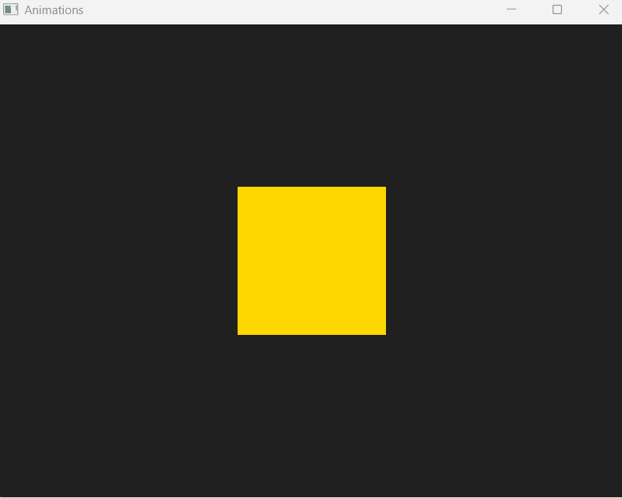

# QMLParrallelAnimation

Using Qt and QML, you can create crazy animation using Parallel mode, that means the animation you are setting inside this ParallelAnimation component will be ran at the same time. 

## Example of parallel animation

If we take a look at the repository and the Main.qml file, you will see that there is a Rectangle of color "gold" by default, an a ParallelAnimation. This ParallelAnimation will then run all the animation written in its scope like so: 

```QML
Window {
    ....
    color: "#202020"

    Rectangle {
        id: myRect
        ....
        
        MouseArea {
            ....
            onEntered: parallelAnimation.start()
            onExited: exitAnimation.start()

            ParallelAnimation {
                id: parallelAnimation
                NumberAnimation {
                    id: numberAnimation
                    target: myRect
                    property: "scale"
                    from: 1
                    to: 2
                    duration: 600
                }
                ColorAnimation {
                    id: colorAnimation
                    target: myRect
                    property: "color"
                    from: "gold"
                    to: "lightgreen"
                    duration: 600
                }
            }
            ...
        }
    }
}
```
If you take a closer look on the Rectangle identified by `myRect`, you'll see that a `MouseArea` that is filling the parent (in our case, the `myRect` rectangle), that has 2 events handled:
1. `onEntered` event, which gets fired once the mouse is entering in the mouse (as this `MouseArea` is filling the rectangle, we can say that the `onEntered` is fired once the mouse is hovering the rectangle)
2. `onExited` event, which gets fired once the mouse is leaving the rectangle `myRect`.
Both of the events are triggering animations through their identifiers.

## Result


